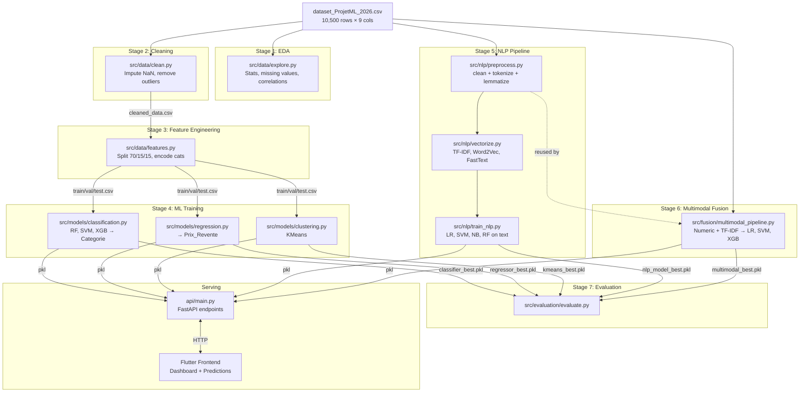

# 🔗 How Your Entire Pipeline is Connected

## The Big Picture

Your project is a **9-stage DVC pipeline** defined in [dvc.yaml](file:///c:/Users/User/Desktop/Proj%20WHO/backend/dvc.yaml), with a **FastAPI backend** serving the trained models to a **Flutter frontend**.



---

## Where Each Step Lives

### 📊 Step 1 — EDA (Exploration)
**File:** [explore.py](file:///c:/Users/User/Desktop/Proj%20WHO/backend/src/data/explore.py)

**What it does:**
- Loads raw CSV → computes stats (`.describe()`, missing values, correlations)
- Saves `reports/eda_profile.json`
- Logs to MLflow experiment `eda-profiling`

**You also have:** [explore.ipynb](file:///c:/Users/User/Desktop/Proj%20WHO/backend/src/data/explore.ipynb) — an interactive notebook version

---

### 🧹 Step 2 — Cleaning
**File:** [clean.py](file:///c:/Users/User/Desktop/Proj%20WHO/backend/src/data/clean.py)

**What it does:**
- Reads `params.yaml` → picks imputer type (KNN or SimpleImputer)
- Imputes numeric NaN (median/KNN)
- Fills categorical NaN (`Categorie`, `Source`) with `"Unknown"`
- Removes rows with negative Poids/Volume/Prix_Revente
- Removes extreme outliers via **3× IQR**
- **Output:** `data/cleaned_data.csv`

---

### ⚙️ Step 3 — Feature Engineering & Split
**File:** [features.py](file:///c:/Users/User/Desktop/Proj%20WHO/backend/src/data/features.py)

**What it does:**
- Loads `cleaned_data.csv`
- Drops rows where Categorie = "Unknown"
- Stratified split: **70% train / 15% val / 15% test**
- **Output:** `data/train.csv`, `data/val.csv`, `data/test.csv`

---

### 🤖 Step 4 — ML Model Training (Numeric)
| File | Task | Output |
|---|---|---|
| [classification.py](file:///c:/Users/User/Desktop/Proj%20WHO/backend/src/models/classification.py) | Predict `Categorie` from numeric features | `models/classifier_best.pkl` |
| [regression.py](file:///c:/Users/User/Desktop/Proj%20WHO/backend/src/models/regression.py) | Predict `Prix_Revente` | `models/regressor_best.pkl` |
| [clustering.py](file:///c:/Users/User/Desktop/Proj%20WHO/backend/src/models/clustering.py) | KMeans clustering | `models/kmeans_best.pkl` |

---

### 📝 Step 5 — NLP Pipeline (This is the TP7 part!)

| Order | File | What it does |
|---|---|---|
| **5a** | [preprocess.py](file:///c:/Users/User/Desktop/Proj%20WHO/backend/src/nlp/preprocess.py) | `Rapport_Collecte` → lowercase → remove punct/digits → spaCy tokenize → remove stopwords → lemmatize |
| **5b** | [vectorize.py](file:///c:/Users/User/Desktop/Proj%20WHO/backend/src/nlp/vectorize.py) | Compares 4 vectorizers: CountVec, TF-IDF, Word2Vec, FastText → saves best to `vectorizer_best.pkl` |
| **5c** | [train_nlp.py](file:///c:/Users/User/Desktop/Proj%20WHO/backend/src/nlp/train_nlp.py) | Loads best vectorizer → trains LR, SVM, NB, RF → logs to MLflow → saves `nlp_model_best.pkl` |

**How they connect:**
```
preprocess.py ──exports──→ preprocess_series()
                              ↓ (imported by)
vectorize.py  ──uses it──→ tokenize all texts → compare vectorizers → save best
                              ↓ (reads vectorizer_best.pkl)
train_nlp.py  ──loads──→ vectorize texts → train classifiers → save nlp_model_best.pkl
```

---

### 🔀 Step 6 — Multimodal Fusion
**File:** [multimodal_pipeline.py](file:///c:/Users/User/Desktop/Proj%20WHO/backend/src/fusion/multimodal_pipeline.py)

**What it does:**
- Imports `preprocess_series` from `preprocess.py` (reuses NLP cleaning)
- **Numeric:** Poids, Volume, Conductivite, Opacite, Rigidite, Prix_Revente → StandardScaler
- **Text:** TF-IDF (1,2)-grams, 5000 features on cleaned `Rapport_Collecte`
- **Fusion:** `scipy.sparse.hstack([numeric, text × weight])`
- Two strategies: equal weight vs NLP×2
- Models: LogReg, LinearSVC, XGBoost
- SHAP explainability plot
- **Output:** `models/fusion/multimodal_best.pkl`

---

### 📈 Step 7 — Evaluation
**File:** [evaluate.py](file:///c:/Users/User/Desktop/Proj%20WHO/backend/src/evaluation/evaluate.py)

Loads ALL 5 models and produces a unified `reports/evaluation.json`.

---

### 🌐 Step 8 — API Serving
**File:** [api/main.py](file:///c:/Users/User/Desktop/Proj%20WHO/backend/api/main.py)

Loads all `.pkl` models at startup and exposes 3 prediction endpoints:

| Endpoint | Input | Uses |
|---|---|---|
| `POST /predict/numeric` | Poids, Volume, etc. | `classifier_best.pkl` + `regressor_best.pkl` |
| `POST /predict/text` | `rapport` string | `nlp_model_best.pkl` + `vectorizer_best.pkl` |
| `POST /predict/multimodal` | Both numeric + text | All models + KMeans |

> [!IMPORTANT]
> The API has its **own lightweight `preprocess_text()`** function (line 232) that does NOT use spaCy — it uses a simple regex + French stopword list for faster inference. This is a simplified version of what `preprocess.py` does during training.

---

### 📱 Step 9 — Flutter Frontend
Calls the FastAPI endpoints via [api_service.dart](file:///c:/Users/User/Desktop/Proj%20WHO/frontend/lib/data/services/api_service.dart) and displays results in the dashboard using [dashboard_stats.dart](file:///c:/Users/User/Desktop/Proj%20WHO/frontend/lib/data/models/dashboard_stats.dart).

---

## Saved Model Artifacts

All trained models live in `backend/models/`:

```
models/
├── classifier_best.pkl          ← Step 4 (classification)
├── regressor_best.pkl           ← Step 4 (regression)
├── kmeans_best.pkl              ← Step 4 (clustering)
├── nlp/
│   ├── vectorizer_best.pkl      ← Step 5b (best vectorizer)
│   ├── nlp_model_best.pkl       ← Step 5c (best NLP classifier)
│   ├── label_encoder.pkl        ← Step 5b (category encoder)
│   └── artifacts/               ← Confusion matrix PNGs
└── fusion/
    ├── multimodal_best.pkl      ← Step 6 (fusion model)
    └── artifacts/               ← CM + SHAP PNGs
```
