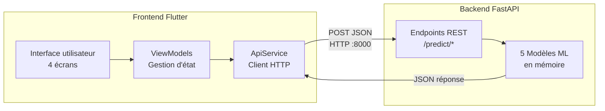
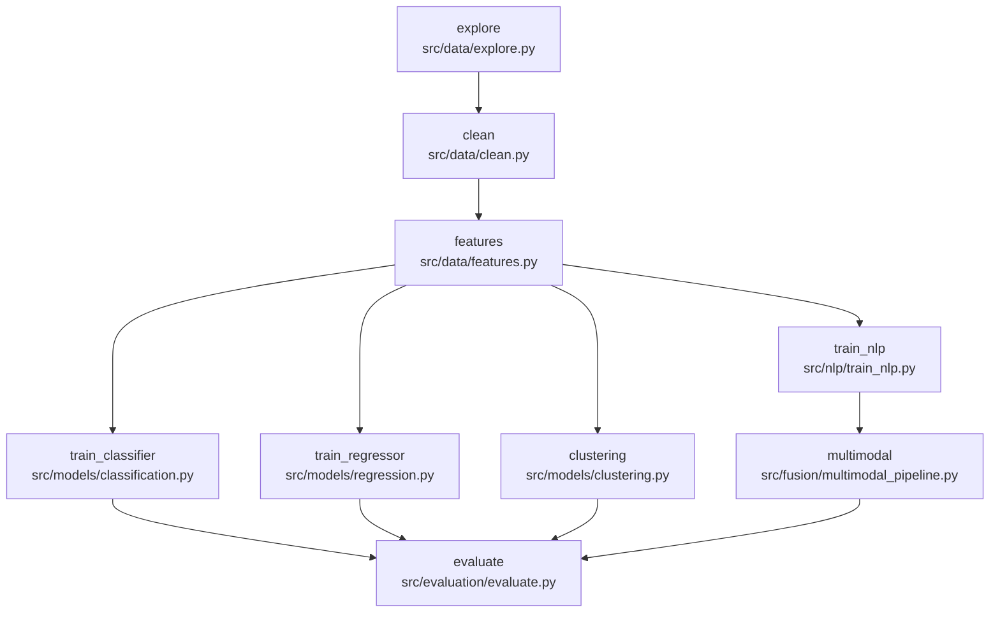
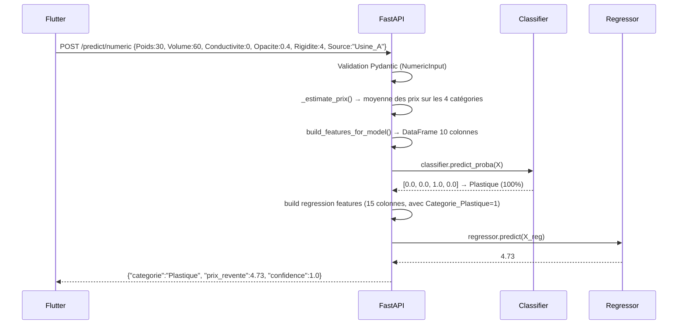
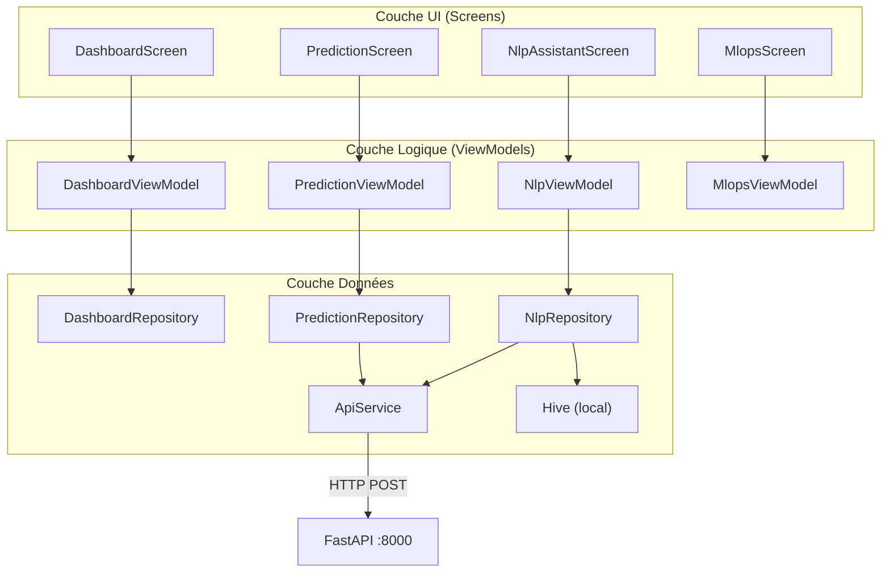

# Rapport Technique — EcoSmart Classifier

## Projet de Classification Intelligente des Déchets

**Date :** Mai 2026
**Stack :** Python (FastAPI, scikit-learn, MLflow) + Flutter (Dart, Provider)

---

## 1. Vue d'ensemble du projet

EcoSmart Classifier est une application complète de **classification de déchets recyclables** combinant un pipeline de Machine Learning (entraînement, évaluation, déploiement) avec une interface mobile/web moderne. L'application prédit la catégorie d'un déchet parmi quatre classes — **Métal, Papier, Plastique, Verre** — à partir de caractéristiques physiques mesurées ou d'une description textuelle en langage naturel.



---

## 2. Phases de développement

### Phase 1 — Pipeline de données et d'entraînement

Le pipeline ML est orchestré par **DVC** (Data Version Control) via le fichier [dvc.yaml](file:///c:/Users/User/Desktop/Proj%20WHO/backend/dvc.yaml). Il comporte **8 étapes séquentielles**, chacune définie comme un stage DVC avec ses dépendances, sorties et paramètres :



| Étape | Script | Entrée | Sortie |
|-------|--------|--------|--------|
| `explore` | `src/data/explore.py` | `dataset_ProjetML_2026.csv` | `reports/eda_profile.json` |
| `clean` | `src/data/clean.py` | CSV brut | `data/cleaned_data.csv` |
| `features` | `src/data/features.py` | Données nettoyées | `data/train.csv`, `val.csv`, `test.csv` |
| `train_classifier` | `src/models/classification.py` | CSV brut | `models/classifier_best.pkl` |
| `train_regressor` | `src/models/regression.py` | CSV brut | `models/regressor_best.pkl` |
| `clustering` | `src/models/clustering.py` | CSV brut | `models/kmeans_best.pkl` |
| `train_nlp` | `src/nlp/train_nlp.py` | CSV + preprocess + vectorize | `models/nlp/*.pkl` |
| `multimodal` | `src/fusion/multimodal_pipeline.py` | CSV + preprocess | `models/fusion/multimodal_best.pkl` |
| `evaluate` | `src/evaluation/evaluate.py` | Tous les modèles | `reports/evaluation.json` |

Les hyperparamètres sont centralisés dans [params.yaml](file:///c:/Users/User/Desktop/Proj%20WHO/backend/params.yaml) :
- Split : 70% train / 15% validation / 15% test, stratifié par `Categorie`
- Classification : 200 estimateurs, profondeur max 15, 50 essais Optuna
- Algorithmes testés : RandomForest, GradientBoosting, XGBoost, LightGBM, LogisticRegression
- NLP : TF-IDF, 5 000 features max, n-grammes (1,2)
- Clustering : K de 2 à 10 (meilleur K=6)

### Phase 2 — Développement de l'API backend

L'API REST est construite avec **FastAPI** et servie par **Uvicorn**. Le fichier principal est [api/main.py](file:///c:/Users/User/Desktop/Proj%20WHO/backend/api/main.py) (~500 lignes). La validation des entrées est assurée par **Pydantic v2** dans [api/schemas.py](file:///c:/Users/User/Desktop/Proj%20WHO/backend/api/schemas.py).

### Phase 3 — Développement de l'interface Flutter

L'application Flutter suit une architecture **MVVM en couches** (UI → ViewModel → Repository → Service). Le point d'entrée est [main.dart](file:///c:/Users/User/Desktop/Proj%20WHO/frontend/lib/main.dart) qui initialise Hive (stockage local), crée les singletons de services et injecte les ViewModels via `MultiProvider`.

### Phase 4 — Débogage et stabilisation

Plusieurs bugs critiques ont été résolus durant cette phase :

1. **Bug TextField (Web)** — Le moteur CanvasKit de Flutter Web détruisait et recréait le `TextField` à chaque `notifyListeners()` du ViewModel, causant la perte du texte saisi. **Résolution** : extraction du `TextEditingController` dans un `StatefulWidget` dédié, isolé du `ListenableBuilder`.

2. **Erreur 422 (validation Pydantic)** — Les plages des curseurs frontend ne correspondaient pas aux contraintes du schéma API (`Conductivité ≤ 1`, `Rigidité ∈ [1,10]`). **Résolution** : alignement des `min/max/divisions` des sliders.

3. **Prédiction toujours "Verre"** — Le classifieur original incluait `Prix_Revente` comme feature d'entraînement (fuite de données). À l'inférence, cette valeur était mise à 0, biaisant toutes les prédictions. **Résolution** : ré-entraînement du classifieur sans `Prix_Revente`.

4. **"No module named spacy"** — Le prétraitement NLP importait spaCy (non installé). **Résolution** : remplacement par un tokeniseur léger à base de regex directement dans `api/main.py`.

5. **Plastique jamais prédit** — Le curseur Opacité (divisions=100, plage 0–100) avait un pas minimal de 1.0, empêchant d'atteindre les valeurs typiques du Plastique (0.2–0.6). **Résolution** : augmentation à 1000 divisions (pas de 0.1).

---

## 3. Architecture technique

### 3.1 Structure du projet

```
Proj WHO/
├── backend/                          # Serveur Python
│   ├── api/
│   │   ├── main.py                   # Application FastAPI (endpoints + chargement modèles)
│   │   └── schemas.py                # Modèles Pydantic (validation entrées/sorties)
│   ├── src/
│   │   ├── data/                     # explore.py, clean.py, features.py
│   │   ├── models/                   # classification.py, regression.py, clustering.py
│   │   ├── nlp/                      # preprocess.py, vectorize.py, train_nlp.py
│   │   ├── fusion/                   # multimodal_pipeline.py
│   │   ├── evaluation/               # evaluate.py
│   │   └── monitoring/               # Détection de dérive (Evidently)
│   ├── models/                       # Artefacts .pkl entraînés
│   │   ├── classifier_best.pkl       # RandomForestClassifier (3.4 Mo)
│   │   ├── regressor_best.pkl        # Régresseur prix (46.7 Mo)
│   │   ├── kmeans_best.pkl           # KMeans k=6 (42 Ko)
│   │   ├── nlp/
│   │   │   ├── nlp_model_best.pkl    # LogisticRegression texte
│   │   │   ├── vectorizer_best.pkl   # CountVectorizer sklearn
│   │   │   └── label_encoder.pkl     # LabelEncoder catégories
│   │   └── fusion/
│   │       └── multimodal_best.pkl   # LinearSVC (numérique + texte)
│   ├── dataset_ProjetML_2026.csv     # Jeu de données (9 986 lignes, 2.5 Mo)
│   ├── dvc.yaml                      # Pipeline DVC (8 stages)
│   ├── params.yaml                   # Hyperparamètres centralisés
│   ├── requirements.txt              # Dépendances Python
│   ├── Dockerfile                    # Image Docker multi-stage
│   ├── docker-compose.yml            # Stack MLOps complète
│   ├── prometheus.yml                # Config scraping Prometheus
│   └── mlruns.db                     # Base SQLite MLflow
│
├── frontend/                         # Application Flutter
│   ├── pubspec.yaml                  # Dépendances Dart
│   └── lib/
│       ├── main.dart                 # Point d'entrée + injection Provider
│       ├── core/theme/
│       │   ├── app_colors.dart       # Palette de couleurs (dark mode)
│       │   ├── app_fonts.dart        # Typographies (Inter, Space Grotesk)
│       │   └── app_theme.dart        # ThemeData Material
│       ├── shared/
│       │   ├── router.dart           # Navigation go_router (4 onglets)
│       │   └── widgets/              # Composants réutilisables
│       │       ├── feature_slider.dart
│       │       ├── confidence_bar.dart
│       │       ├── category_badge.dart
│       │       ├── eco_card.dart
│       │       ├── hero_bar.dart
│       │       └── section_label.dart
│       ├── data/
│       │   ├── models/               # Classes de données Dart
│       │   │   ├── prediction_result.dart
│       │   │   ├── nlp_result.dart
│       │   │   └── dashboard_stats.dart
│       │   ├── repositories/         # Couche logique métier
│       │   │   ├── prediction_repository.dart
│       │   │   ├── nlp_repository.dart
│       │   │   └── dashboard_repository.dart
│       │   └── services/
│       │       └── api_service.dart   # Client HTTP (appels REST)
│       └── features/
│           ├── dashboard/            # Écran statistiques
│           ├── prediction/           # Écran prédiction (curseurs)
│           ├── nlp_assistant/        # Écran analyse NLP
│           └── mlops/                # Tableau de bord MLOps
```

### 3.2 Le jeu de données

Le fichier `dataset_ProjetML_2026.csv` contient **9 986 échantillons** avec 9 colonnes :

| Colonne | Type | Description | Plage typique |
|---------|------|-------------|---------------|
| `Poids` | float | Masse en kg | 5 – 300 |
| `Volume` | float | Volume en litres | 10 – 550 |
| `Conductivite` | float | Conductivité électrique | 0.0 ou 0.8–1.0 |
| `Opacite` | float | Mesure d'opacité | 0.2 – 55 |
| `Rigidite` | float | Score de rigidité | 1 – 10 |
| `Prix_Revente` | float | Prix de revente €/kg | Variable |
| `Categorie` | str | **Cible classification** | Métal, Papier, Plastique, Verre |
| `Source` | str | Source de collecte | Usine_A, Usine_B, Centre_Tri, Collecte_Citoyenne |
| `Rapport_Collecte` | str | Description textuelle | Texte libre en français |

**Distribution des classes :** Plastique (2 795), Verre (2 586), Papier (2 318), Métal (2 287) — distribution équilibrée.

**Signatures discriminantes par catégorie :**

| Catégorie | Conductivité | Opacité (moy.) | Rigidité | Volume (moy.) |
|-----------|-------------|----------------|----------|---------------|
| Métal | **0.89** | 1.56 | 7–10 | 121 L |
| Papier | 0.0 | 1.26 | 1–3 | 33 L |
| Plastique | 0.0 | 0.95 | 3–5 | 59 L |
| Verre | 0.0 | 0.94 | 8–10 | 359 L |

---

## 4. Les 5 modèles de Machine Learning

### 4.1 Classifieur — `classifier_best.pkl`

- **Type :** `RandomForestClassifier` (scikit-learn)
- **Tâche :** Classification multi-classe (4 catégories)
- **Features :** Poids, Volume, Conductivite, Opacite, Rigidite + 5 colonnes one-hot Source_*
- **Hyperparamètres :** 200 estimateurs, profondeur max 15
- **Performance :** Accuracy ≈ 99.5%, F1 macro ≈ 1.00

> [!IMPORTANT]
> Le classifieur a été ré-entraîné **sans** `Prix_Revente` pour éliminer une fuite de données (data leakage). En effet, le prix de revente n'est pas connu au moment de la prédiction.

### 4.2 Régresseur — `regressor_best.pkl`

- **Type :** Modèle de régression (RandomForest/XGBoost)
- **Tâche :** Prédiction du prix de revente (€/kg)
- **Features :** Poids, Volume, Conductivite, Opacite, Rigidite + Categorie_* (one-hot) + Source_* (one-hot) — 15 colonnes au total
- **Note :** Utilise la catégorie prédite comme feature d'entrée

### 4.3 KMeans — `kmeans_best.pkl`

- **Type :** `KMeans` (scikit-learn)
- **Tâche :** Segmentation non supervisée en 6 clusters
- **Features :** Poids, Volume, Conductivite, Opacite, Rigidite, Prix_Revente
- **Usage :** Attribue un `cluster_id` dans le mode multimodal

### 4.4 Modèle NLP — `nlp/nlp_model_best.pkl`

- **Type :** `LogisticRegression`
- **Vectoriseur :** `CountVectorizer` (sklearn), stocké dans `vectorizer_best.pkl`
- **Encodeur :** `LabelEncoder` dans `label_encoder.pkl`
- **Tâche :** Classification de catégorie à partir du texte `Rapport_Collecte`
- **Prétraitement :** Nettoyage regex (minuscules, suppression ponctuation/chiffres, retrait des mots vides français)

### 4.5 Modèle multimodal — `fusion/multimodal_best.pkl`

- **Type :** `LinearSVC`
- **Tâche :** Classification combinant features numériques et textuelles
- **Approche :** Concaténation des features numériques avec le vecteur TF-IDF du texte

---

## 5. API Backend — Endpoints et communication

### 5.1 Architecture de l'API

Le serveur est défini dans [api/main.py](file:///c:/Users/User/Desktop/Proj%20WHO/backend/api/main.py). Au démarrage (`lifespan`), la fonction `load_all_models()` charge les 5 modèles `.pkl` en mémoire dans un dictionnaire global `models`. Le chargement tente d'abord le **MLflow Model Registry** (`models:/{name}/latest`), puis se rabat sur le fichier `.pkl` local.

### 5.2 Endpoints disponibles

| Méthode | Route | Entrée | Sortie | Fichier |
|---------|-------|--------|--------|---------|
| `GET` | `/health` | — | `{ status, model_version }` | [api/main.py](file:///c:/Users/User/Desktop/Proj%20WHO/backend/api/main.py) |
| `POST` | `/predict/numeric` | `NumericInput` | `{ categorie, prix_revente, confidence }` | [api/main.py](file:///c:/Users/User/Desktop/Proj%20WHO/backend/api/main.py) |
| `POST` | `/predict/text` | `TextInput` | `{ categorie, confidence }` | [api/main.py](file:///c:/Users/User/Desktop/Proj%20WHO/backend/api/main.py) |
| `POST` | `/predict/multimodal` | `MultimodalInput` | `{ categorie, prix_revente, confidence, cluster_id }` | [api/main.py](file:///c:/Users/User/Desktop/Proj%20WHO/backend/api/main.py) |
| `GET` | `/metrics` | — | Métriques Prometheus | Auto-généré |

### 5.3 Schémas de validation — `api/schemas.py`

Les entrées sont validées par **Pydantic v2** avec des contraintes strictes :

```python
class NumericInput(BaseModel):
    Poids: float         # ge=0
    Volume: float        # ge=0
    Conductivite: float  # ge=0, le=1
    Opacite: float       # ge=0
    Rigidite: float      # ge=1, le=10
    Source: str

class TextInput(BaseModel):
    rapport: str         # min_length=5
```

### 5.4 Flux de prédiction numérique (détaillé)



### 5.5 CORS et middleware

```python
app.add_middleware(
    CORSMiddleware,
    allow_origins=["*"],       # Autorise le frontend Flutter Web
    allow_methods=["*"],
    allow_headers=["*"],
)
Instrumentator().instrument(app).expose(app)  # Métriques Prometheus sur /metrics
```

---

## 6. Frontend Flutter — Architecture et écrans

### 6.1 Technologies utilisées

| Package | Version | Rôle |
|---------|---------|------|
| `flutter` | SDK ≥3.4.0 | Framework UI |
| `provider` | ^6.1.2 | Gestion d'état (injection de dépendances) |
| `go_router` | ^14.6.1 | Navigation déclarative (4 onglets) |
| `http` | ^1.2.2 | Client HTTP pour appels API |
| `hive` / `hive_flutter` | ^2.2.3 | Persistance locale (historique NLP) |
| `fl_chart` | ^0.70.2 | Graphiques (dashboard, MLOps) |
| `flutter_svg` | ^2.0.10 | Icônes SVG |
| `google_fonts` | ^6.2.1 | Polices Inter et Space Grotesk |
| `intl` | ^0.20.2 | Formatage nombres/devises |

### 6.2 Architecture MVVM en couches



**Point d'entrée** — [main.dart](file:///c:/Users/User/Desktop/Proj%20WHO/frontend/lib/main.dart) :
1. Initialise Hive (stockage local)
2. Crée `ApiService` (singleton HTTP)
3. Injecte tous les ViewModels via `MultiProvider`
4. Lance `MaterialApp.router` avec le thème dark

### 6.3 Communication Frontend → Backend

Le fichier [api_service.dart](file:///c:/Users/User/Desktop/Proj%20WHO/frontend/lib/data/services/api_service.dart) est le **point unique de communication** avec le backend :

```dart
// Détection automatique de la plateforme
String get kApiBaseUrl {
  if (kIsWeb) return 'http://localhost:8000';   // Navigateur
  return 'http://10.0.2.2:8000';                // Émulateur Android
}
```

Trois méthodes d'appel :
- `predictNumeric()` → `POST /predict/numeric`
- `predictText()` → `POST /predict/text`
- `predictMultimodal()` → `POST /predict/multimodal`

Chaque appel sérialise les données en JSON, envoie via `http.Client.post()` avec un timeout de 15 secondes, puis désérialise la réponse.

### 6.4 Les 4 écrans

| Écran | Route | Fichier principal | Fonctionnalité |
|-------|-------|-------------------|----------------|
| Dashboard | `/dashboard` | `features/dashboard/views/dashboard_screen.dart` | Statistiques globales, graphiques de distribution |
| Prédiction | `/predict` | `features/prediction/views/prediction_screen.dart` | 5 curseurs + sélection source → prédiction catégorie + prix |
| Assistant NLP | `/nlp` | `features/nlp_assistant/views/nlp_screen.dart` | Saisie texte libre → prédiction catégorie + historique Hive |
| MLOps | `/mlops` | `features/mlops/views/mlops_screen.dart` | Expériences MLflow, dérive de données, pipeline |

### 6.5 Design System

- **Fond :** Noir-vert foncé `#0B1610` (mode sombre exclusif)
- **Couleur primaire :** Vert éco `#22C55E`
- **Couleur NLP :** Violet IA `#7C3AED`
- **Couleur MLOps :** Bleu `#0EA5E9`
- **Polices :** Inter (corps de texte), Space Grotesk (données numériques)
- **Composants partagés :** `FeatureSlider`, `ConfidenceBar`, `CategoryBadge`, `EcoCard`, `HeroBar`, `SectionLabel`

---

## 7. Infrastructure MLOps

### 7.1 Stack de déploiement

Le fichier [docker-compose.yml](file:///c:/Users/User/Desktop/Proj%20WHO/backend/docker-compose.yml) définit 4 services conteneurisés :

| Service | Image | Port | Rôle |
|---------|-------|------|------|
| `api` | Build local (Dockerfile) | 8000 | API FastAPI de prédiction |
| `mlflow` | `ghcr.io/mlflow/mlflow:v2.16.0` | 5000 | Tracking d'expériences + Model Registry |
| `prometheus` | `prom/prometheus:latest` | 9090 | Collecte de métriques (scrape toutes les 15s) |
| `grafana` | `grafana/grafana:latest` | 3000 | Visualisation des métriques |

### 7.2 Dockerfile

Le [Dockerfile](file:///c:/Users/User/Desktop/Proj%20WHO/backend/Dockerfile) utilise un **build multi-stage** :
- **Stage 1 (builder)** : Python 3.11-slim, installation des dépendances et du modèle spaCy français
- **Stage 2 (runtime)** : Image minimale, utilisateur non-root `appuser`, healthcheck intégré

### 7.3 Suivi des expériences

- **MLflow** stocke les métriques dans `mlruns.db` (SQLite) et les artefacts dans `mlruns/`
- La fonction `try_mlflow_or_pkl()` dans `api/main.py` tente de charger depuis le **Model Registry** MLflow avant de se rabattre sur le fichier `.pkl`
- **DVC** versionne le pipeline complet et les données via `dvc.yaml`

### 7.4 Monitoring en production

- **Prometheus** scrape l'endpoint `/metrics` de l'API toutes les 15 secondes
- `prometheus-fastapi-instrumentator` expose automatiquement : nombre de requêtes, latence, codes de réponse
- **Grafana** visualise ces métriques avec rétention de 30 jours
- **Evidently** (dans `src/monitoring/`) détecte la dérive de données (data drift)

---

## 8. Résumé des technologies

| Couche | Technologies |
|--------|-------------|
| **ML / Data Science** | scikit-learn, XGBoost, LightGBM, Optuna, SHAP, pandas, NumPy |
| **NLP** | CountVectorizer (sklearn), regex preprocessing, gensim |
| **API** | FastAPI, Pydantic v2, Uvicorn |
| **Frontend** | Flutter 3.4+, Dart, Provider, go_router, Hive, fl_chart |
| **MLOps** | MLflow 2.16, DVC 3.30, Docker, docker-compose |
| **Monitoring** | Prometheus, Grafana, Evidently |
| **Tests** | pytest, pytest-cov, httpx |
| **Qualité de code** | black, flake8, isort, flutter_lints |

---

## 9. Commandes de lancement

### Backend
```powershell
cd backend
.\venv\Scripts\Activate.ps1
uvicorn api.main:app --reload          # Démarre sur http://localhost:8000
```

### Frontend
```powershell
cd frontend
flutter run -d chrome                  # Démarre sur http://localhost:PORT
```

### Stack MLOps complète (Docker)
```powershell
cd backend
docker-compose up -d                   # API:8000, MLflow:5000, Prometheus:9090, Grafana:3000
```
